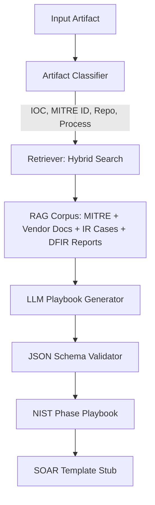

# HuntLens - AI SOC Copilot

HuntLens is an **AI-powered SOC copilot**. Give it any SOC artifact - IOC, MITRE ATT&CK ID, attacker GitHub repo, or suspicious process, and it generates NIST 800-61 aligned playbooks (Detection to Resolution). HuntLens delivers queries, EDR steps, threat context; suggests risk prioritization, business impact, optional automation-ready SOAR templates, and confidence/rationale scoring - all grounded in trusted sources.

HuntLens acts as a knowledge-augmented assistant for SOC teams: providing context, generating detection queries, guiding response, and suggesting workflow automation, all with analyst safety and clarity.

---

## Features

- **Explain Artifacts**: Context, ATT&CK mappings, and adversary intent for IOCs, processes, MITRE IDs, and attacker repos.
- **Generate Detection Queries**: Splunk SPL, Microsoft Sentinel KQL, and Elastic EQL templates tailored to artifacts.
- **Guide Response Actions**: EDR commands, forensic steps, and escalation paths mapped to NIST phases.
- **Produce SOAR Templates**: Automation-ready YAML/JSON stubs for Cortex XSOAR, Splunk SOAR, and ServiceNow.
- **Teach Operators**: Outputs double as step-by-step playbooks and training material for Tier-1/Tier-2 analysts.
- **Stay Grounded**: Every recommendation cites MITRE, vendor KBs, DFIR reports, or sanitized IR cases.

---

## Architecture

HuntLens uses a retrieval-augmented generation (RAG) pipeline, hybrid semantic search, and JSON schema validation to generate safe, structured outputs.



---

## Example Playbook Output

All HuntLens outputs follow a consistent schema:

```json
{
  "artifact": "mimikatz.exe",
  "artifact_type": "process",
  "nist_phase_playbook": {
    "detection": [
      {
        "id": "det-1",
        "short_description": "Search for process creation with mimikatz.exe",
        "how": "Splunk SPL or Sentinel KQL queries",
        "who": "SOC Tier-1",
        "references": ["MITRE T1003"]
      }
    ],
    "analysis": [],
    "containment": [],
    "eradication": [],
    "recovery": [],
    "post_incident": []
  },
  "soar_playbook_template": "YAML/JSON stub",
  "references": ["MITRE ATT&CK", "Vendor KBs", "IR case library"]
}
```

---

## SOAR Playbook Types

HuntLens produces automation-ready stubs for SOAR platforms:
- **Detection enrichment**: Threat intel lookups, log queries, IOC enrichment.
- **Containment**: Host isolation, account disablement, IP/domain blocking (always flagged for human review).
- **Eradication & Recovery**: Malware removal, credential resets, patch deployment.
- **Investigation & Forensics**: Memory capture, process tree analysis, PCAP extraction.
- **Notification & Ticketing**: ServiceNow incidents, Slack/Teams alerts, escalation emails.

---

## Safety & Disclaimer

HuntLens is a **copilot, not an autopilot**. It supports SOC analysts by providing decision-support, structured guidance, and automation templates, but never replaces human judgment.

### Limitations

- Does **not** autonomously remediate threats.
- Cannot guarantee complete accuracy or absence of hallucinations.
- Is **not** a replacement for chain-of-custody forensic procedures.
- Does **not** access telemetry without integrations.
- Cannot detect zero-day or novel threats without supporting intelligence.
- Should only ingest sanitized, license-cleared inputs.
- Does **not** supersede human verification, analyst training or experience.

### Safe Usage Guidelines

- Treat all remediation steps as **recommendations only**.
- Require **human review** for containment and eradication.
- Use sanitized, license-cleared inputs for ingestion.
- Maintain audit logs and SOC governance for all outputs used in production workflows.

---

**Get started, contribute, and help build a safer SOC!**


- Example Inputs: IOC, MITRE ID, suspicious process, attacker GitHub repo, cloud commands (e.g. AWS).
- Outputs: NIST 800-61 aligned playbooks with queries, EDR steps, SOAR templates, and confidence/rationale scoring.

## Quick Start
1. `pip install -e .`
2. Run backend: `uvicorn src.huntlens.api:app --reload`
3. Run frontend: `cd web && npm install && npm run dev`

See `docs/driver_plan.md` for Copilot instructions


HuntLens is an AI SOC copilot. Feed it any SOC artifact, IOC, MITRE ID, attacker GitHub repos, or suspicious process, and it generates NIST-aligned playbooks (Detection to Resolution) with queries, EDR steps, context, risk priotization, business impact, and optional SOAR templates - all grounded in trusted sources.

